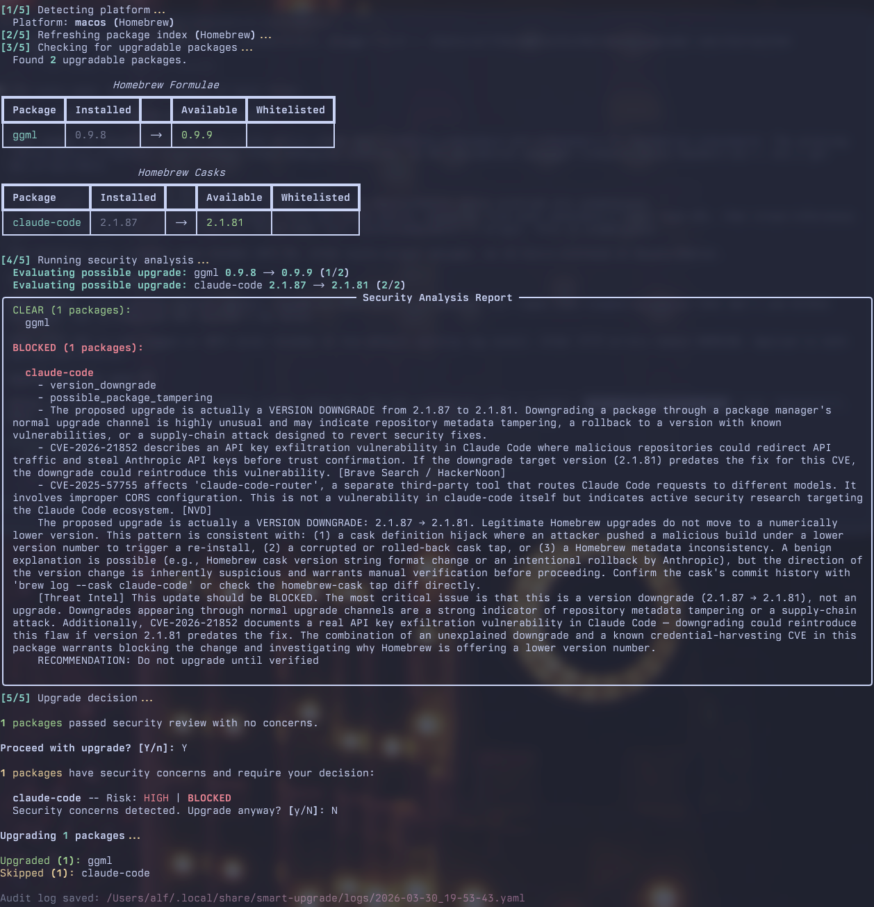

# smart-upgrade

Security-aware system package upgrade tool powered by Claude AI.

Instead of blindly running `apt upgrade` or `brew upgrade`, `smart-upgrade` inserts an AI-driven security review between "check for updates" and "install updates" to help detect supply-chain attacks before they reach your system.



## What's New in 0.2.0

- **Origin-based auto-whitelisting (APT)**: Trust all packages from official Ubuntu/Debian repositories with a single config line (`apt-trusted-origins: [Ubuntu]`) instead of maintaining long name-based lists. Third-party packages (PPAs, Brave, etc.) still get full security analysis.
- **APT metadata enrichment**: Package maintainer and homepage are now populated in the audit log via a batched `apt show` call, with a source-package fallback for packages (like ESM variants) whose binary metadata omits Homepage.
- **APT changelog GitHub fallback**: When `apt changelog` fails (third-party and ESM packages), the adapter now checks the package's homepage for a GitHub URL and fetches release notes via the GitHub API -- the same strategy used by the Homebrew adapter.
- **Live APT upgrade streaming**: `sudo apt upgrade` output is now streamed directly to the terminal so you can see download/install progress in real time and respond to interactive dpkg prompts (e.g., config file conflict questions).
- **Color-coded analysis progress**: During security analysis, each non-whitelisted package now shows a Rich-formatted progress line (`Evaluating possible upgrade: <name> <old> -> <new> (N/M)`) instead of relying solely on log messages.
- **Default log level changed to `warning`**: The `[INFO]` log messages are no longer shown by default since the new Rich progress messages provide better user feedback. Use `--log-level info` or `--log-level debug` for verbose output.

## How It Works

1. **Refreshes** your package index (`apt update` / `brew update`)
2. **Lists** all available upgrades
3. **Analyzes** each package through three security layers:
   - **Layer A** -- Claude reviews the full upgrade list for anomalies (typosquatting, unexpected version jumps, unusual packages)
   - **Layer B** -- Threat intelligence from Brave Search, OSV.dev, and NVD/CVE databases, synthesized by Claude
   - **Layer C** -- Changelog/diff review by Claude, looking for signs of malicious code injection
4. **Reports** findings with clear risk levels (CLEAR / LOW / MEDIUM / HIGH / CRITICAL)
5. **Prompts** you to approve, reject, or skip each flagged package
6. **Logs** an audit trail of every run

## Supported Platforms

| Platform | Package Manager | Scope |
|---|---|---|
| macOS | Homebrew | Formulae and Casks |
| Debian / Ubuntu | APT | `.deb` packages |

## Requirements

- **Python 3.10+**
- **Claude Code CLI** (`claude`) installed and available on your `$PATH` ([installation guide](https://docs.anthropic.com/en/docs/claude-code))
- **Brave Search API key** (optional, for threat intelligence -- [get one here](https://brave.com/search/api/))
- **NVD API key** (optional, improves rate limits -- [request here](https://nvd.nist.gov/developers/request-an-api-key))

## Installation

### Quick Start (clone & run)

```bash
git clone https://github.com/afalk42/smart-upgrade.git
cd smart-upgrade
python3 -m venv .venv
source .venv/bin/activate
pip install .
```

This creates an isolated Python virtual environment, installs `smart-upgrade`
into it, and makes the `smart-upgrade` command available in your shell.

> **Why a virtual environment?** Modern Python installations (Homebrew, Debian
> 12+, Ubuntu 23.04+) enforce [PEP 668](https://peps.python.org/pep-0668/)
> and block `pip install` outside a venv to protect system packages. The venv
> is the standard, recommended way to install Python tools.

Each time you open a new terminal, activate the venv before running:

```bash
cd smart-upgrade
source .venv/bin/activate
```

To avoid this step, you can add a shell alias to your `~/.zshrc` or `~/.bashrc`:

```bash
alias smart-upgrade='~/path/to/smart-upgrade/.venv/bin/smart-upgrade'
```

### Alternative: run without installing

If you prefer not to install the package, you can run directly from the repo.
You still need a venv for the dependencies:

```bash
git clone https://github.com/afalk42/smart-upgrade.git
cd smart-upgrade
python3 -m venv .venv
source .venv/bin/activate
pip install pyyaml rich       # install dependencies
./scripts/smart-upgrade       # run directly
```

### Verify installation

```bash
smart-upgrade --version
# smart-upgrade 0.2.0
```

## Usage

### Basic usage

```bash
smart-upgrade
```

This runs the full pipeline: refresh index, list upgrades, analyze security, prompt for approval, upgrade.

### Auto-approve clear packages

```bash
smart-upgrade -y
```

Mirrors the behavior of `apt upgrade -y`: automatically upgrades packages that pass security review. Packages with security concerns still prompt for your decision.

### Dry run (analysis only)

```bash
smart-upgrade --dry-run
```

Performs the full security analysis but does not install anything. Useful for reviewing what would happen.

### Use a different Claude model

```bash
smart-upgrade --model sonnet    # faster, cheaper
smart-upgrade --model haiku     # fastest, cheapest
smart-upgrade --model opus      # default, most thorough
```

### Upgrade specific packages only

```bash
smart-upgrade --packages curl openssl git
```

### View your whitelist

```bash
smart-upgrade --show-whitelist
```

### All options

```
smart-upgrade [options]

options:
  -h, --help                 Show help message and exit
  -y, --yes                  Auto-approve when no security concerns found
  --dry-run                  Analyze only, don't upgrade
  --model MODEL              Claude model: opus (default), sonnet, haiku
  --review-depth DEPTH       Source review depth: light (default)
  --config PATH              Config file path
  --packages PKG [PKG ...]   Only consider specific packages
  --show-whitelist           Show whitelist and exit
  --log-level LEVEL          debug, info, warning (default), error
  --version                  Show version and exit
```

## Important: Never Run with sudo

On Linux, `smart-upgrade` needs `sudo` for `apt update` and `apt upgrade` -- but it handles this internally. Always run the tool as your normal user:

```bash
# Correct:
smart-upgrade

# Wrong -- do NOT do this:
sudo smart-upgrade
```

The tool invokes `sudo` only for the specific APT commands that need it and will prompt for your password through the normal `sudo` mechanism. Running the tool itself under `sudo` breaks virtualenv paths, user config resolution, and Claude CLI credentials.

On macOS, Homebrew never requires `sudo`, so no elevation is needed at all.

## Configuration

Create `~/.config/smart-upgrade/config.yaml`:

```yaml
# Claude model for analysis (opus, sonnet, haiku)
model: opus

# Auto-approve when no concerns found (same as -y flag)
auto_approve: false

# Logging verbosity (default: warning)
log_level: warning

# Audit log location
log_directory: ~/.local/share/smart-upgrade/logs

# Packages that skip deep analysis (Layer B + C)
# Supports glob patterns (e.g., linux-image-*) and origin-based auto-whitelisting
whitelist:
  # Trust all packages from official Ubuntu/Debian repos
  apt-trusted-origins:
    - Ubuntu
    # - Debian          # uncomment on Debian systems
  # Additional name-based patterns (for packages not covered by origin)
  apt:
    - coreutils
    - bash
    - systemd
    - linux-image-*
    - linux-headers-*
  brew:
    - curl
    - git
    - openssl@3
    - python@3.*
  brew-cask:
    - firefox
    - google-chrome
    - visual-studio-code

# Threat intelligence sources
threat_intel:
  brave_search:
    enabled: true
    # API key from env var BRAVE_SEARCH_API_KEY, or set here:
    # api_key: "your-key"
  osv:
    enabled: true
  nvd:
    enabled: true
    # API key from env var NVD_API_KEY, or set here:
    # api_key: "your-key"

# Timeouts (seconds)
timeouts:
  package_index_refresh: 120
  claude_analysis: 300
  threat_intel_query: 30
  upgrade_execution: 600
```

### API Keys

API keys can be set via environment variables (recommended) or in the config file:

```bash
export BRAVE_SEARCH_API_KEY="your-brave-api-key"
export NVD_API_KEY="your-nvd-api-key"
```

- **Brave Search**: Required for web-based threat intelligence. Without it, Layer B falls back to NVD only. If the key is set but invalid, you'll see a warning with the specific error from Brave's API.
- **NVD**: Optional but recommended. Without it, NVD queries are rate-limited (~5 requests per 30 seconds).
- **OSV.dev**: Free, no API key required. Note: OSV only covers packages in supported ecosystems (Debian, PyPI, npm, etc.). Homebrew formulae are not tracked by OSV, so NVD provides the vulnerability coverage for brew packages.

## Audit Logs

Every run writes a YAML audit log to `~/.local/share/smart-upgrade/logs/`:

```
~/.local/share/smart-upgrade/logs/
  2026-03-29_14-23-01.yaml
  2026-03-29_16-45-30.yaml
  ...
```

Each log records: pending upgrades (with metadata like homepage and source repo), analysis results, a compact summary of your decisions (package name, approved/skipped, risk level), which packages were upgraded, and any errors. Files are written with `600` permissions (owner read/write only).

## Whitelist

Whitelisted packages still appear in the Layer A overview (high-level list review) but skip the expensive per-package analysis (Layer B threat intelligence, Layer C changelog review).

Use whitelists for packages you trust implicitly -- core OS packages, well-known tools maintained by large organizations. Glob patterns are supported:

```yaml
whitelist:
  apt:
    - linux-image-*    # matches linux-image-6.1.0-generic, etc.
    - libc6
  brew:
    - python@3.*       # matches python@3.12, python@3.13, etc.
```

### Origin-based auto-whitelisting (APT)

On Debian/Ubuntu systems, you can auto-whitelist all packages from trusted distribution repositories instead of listing every package by name. This uses APT's repository origin metadata (the `Origin` field from each repo's Release file) to distinguish official distro packages from third-party ones:

```yaml
whitelist:
  apt-trusted-origins:
    - Ubuntu           # all official Ubuntu repo packages
    - Debian           # all official Debian repo packages
```

For example, on Ubuntu with 90 pending upgrades where 89 are from the official Ubuntu repos and 1 is from a third-party repo (e.g., Brave Browser), setting `apt-trusted-origins: [Ubuntu]` auto-whitelists the 89 Ubuntu packages while the third-party package still gets the full three-layer security analysis.

This works by running `apt-cache policy` to map each package's APT archive to its repository origin label. If a package's origin matches one of your trusted origins, it is whitelisted. Name-based glob patterns and origin-based whitelisting can be used together -- a package is whitelisted if it matches either.

Use `smart-upgrade --show-whitelist` to see both your name patterns and trusted origins.

## What This Tool Aims To Protect Against

- Compromised maintainer accounts
- Malicious code injection in package updates
- Typosquatted package names
- Known CVEs and vulnerabilities
- Suspicious version patterns and maintainer changes

## What This Tool Does NOT Protect Against

- Zero-day supply-chain attacks with no public indicators
- Attacks on the package manager infrastructure itself
- Sophisticated obfuscation in full source code (Light mode reviews changelogs, not full source)
- Binary-level tampering in pre-compiled APT packages

See [SPECIFICATION.md](SPECIFICATION.md) for the complete threat model.

## Development

### Setup

```bash
git clone https://github.com/afalk42/smart-upgrade.git
cd smart-upgrade
python3 -m venv .venv
source .venv/bin/activate
pip install -e ".[dev]"
```

> **Note on editable installs:** `pip install -e .` (editable mode) lets you
> modify source code without reinstalling. If you hit import issues with the
> `smart-upgrade` console command (seen on Python 3.14), use
> `python3 -m smart_upgrade` instead, or install non-editable with `pip install ".[dev]"`.

### Run tests

```bash
pytest tests/ -v
```

### Project structure

```
smart_upgrade/
  cli.py                 # CLI entry point and main orchestration
  config.py              # Configuration loading (YAML)
  models.py              # Data classes and enums
  platform_detect.py     # OS detection
  whitelist.py           # Whitelist matching (glob patterns)
  audit.py               # Audit log writer
  ui.py                  # Rich-based terminal output
  adapters/
    base.py              # Adapter protocol
    apt.py               # APT adapter (Debian/Ubuntu)
    brew.py              # Homebrew adapter (macOS)
  analysis/
    engine.py            # Three-layer analysis orchestrator
    claude_invoker.py    # Claude CLI wrapper
    threat_intel.py      # Brave Search, OSV, NVD clients
    changelog.py         # Changelog retrieval
  prompts/
    layer_a_review.txt   # Package list review prompt
    layer_b_threat_intel.txt  # Threat intel synthesis prompt
    layer_c_changelog.txt     # Changelog review prompt
```

## License

MIT -- see [LICENSE](LICENSE).
